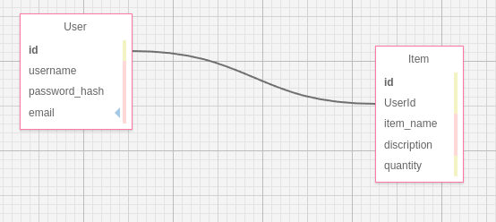
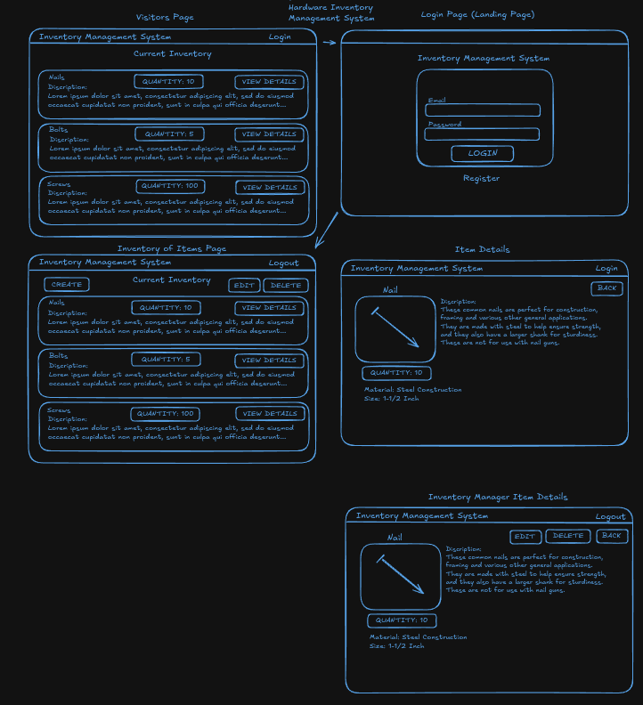
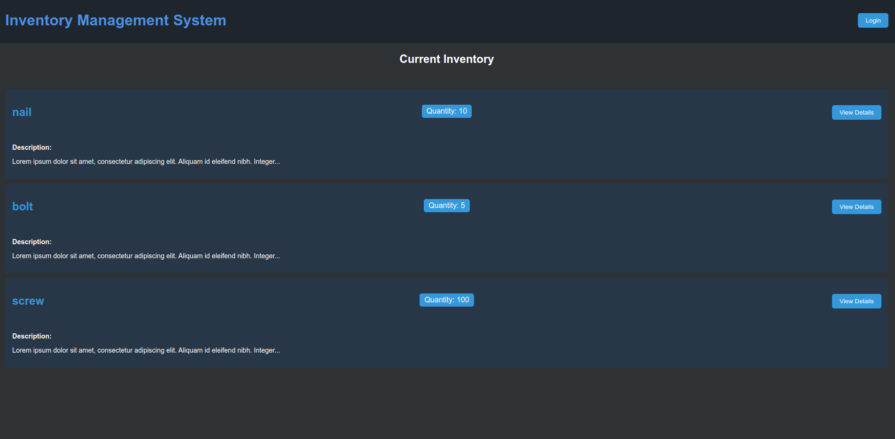
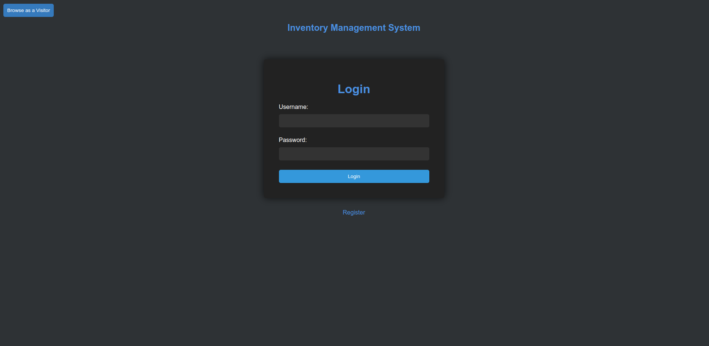
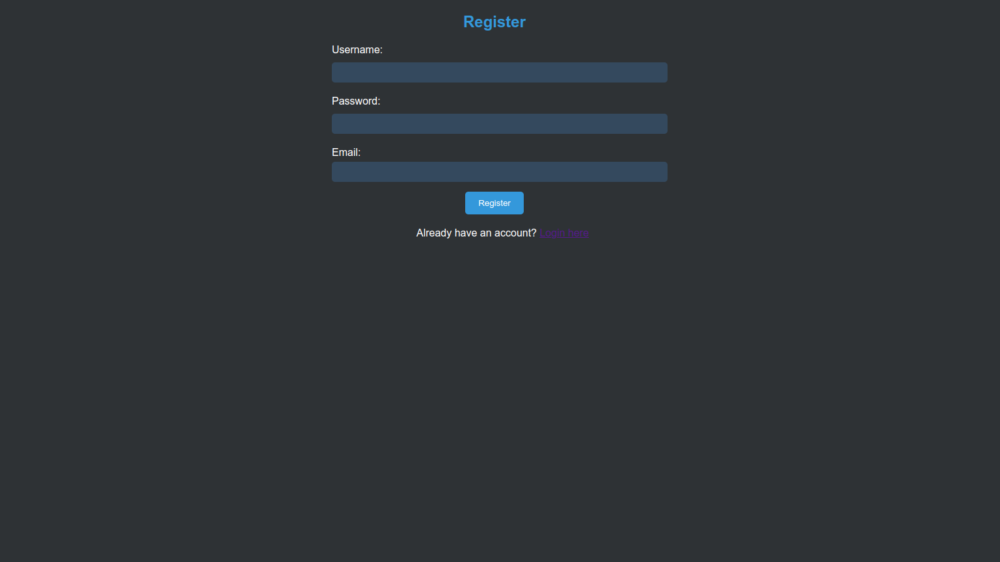
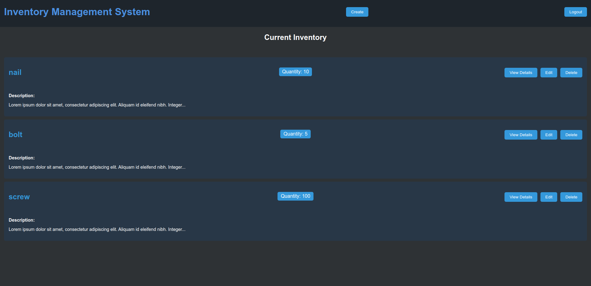
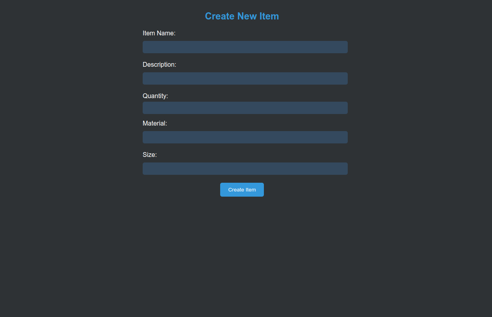
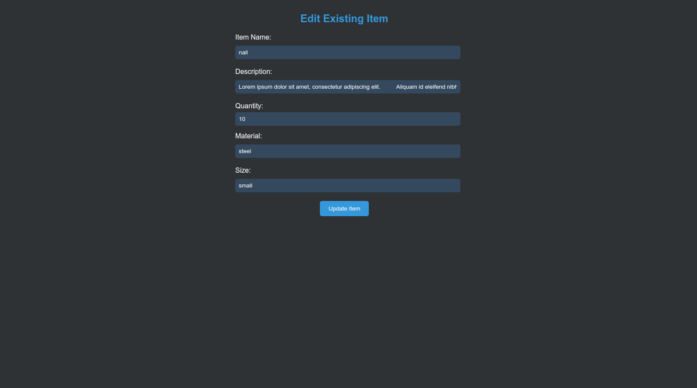

# Inventorysystem
# ZPREFIX

PROCESS ON SPINNING UP THE DOCKER COMPOSE CONTAINERS:

Step 1: Open a terminal
Step 2: In the root of the project type COMMAND: docker compose up --build OR docker compose up

PROCESS ON BRINGING DOWN THE DOCKER COMPOSE CONTAINERS:

Step 1: PRESS "CTRL" then while holding CTRL, PRESS "c"
Step 2: In the root of the project type COMMAND: docker compose down

IMPORTANT!!!
WHEN SPINNING UP THE APPLICATION, YOU MAY NOT BE ABLE TO AUTOMATICALLY SEE CHANGING TO THE CLIENT WHEN ITEMS ARE BEING UPDATED OR DELETED FROM THE SERVER/DATABASE. THIS I LIKELY DO TO THE Dockerfile AND docker-compose.yaml FILE HAVING THE WRONG WORKING DIRECTORY AND TARGET. TO FIX THIS, I CREATED A CLIENT_DIR PATH IN THE .env FILE LOCATED IN MY ROOT DIRECTORY. WHOEVER SPINS THIS APPLICATION UP WILL NEED TO KNOW WHERE THEIR WORKING DIRECTORY AND TARGET DIRECTORY IS FOR THE CLIENT AND CHANGE IT IN THE .env FILE.

IN MY CASE, MY DESKTOP COMPUTER IS /src AND MY LAPTOP IS /app. ONCE DONE, DOCKER COMPOSE DOWN AND BACK UP.

CLIENT: localhost:3000
SERVER API: localhost:8080

how to log in: use first data in database: aaron_berg
password: password1

---------------------------------------------------App Features compaired to User Stories----------------------------------------------------
- As an inventory manager I want to be able to create an account so that I can track my inventory.

      This app has the functionality to create and account and track the inventory of every item in the database.

- As an inventory manager I want to be able to log into my account so that I can see my inventory of items.

      This app has the functionality to login to an account already in the database and see an inventory of items.

- After logging in, the inventory manager should be redirected to their inventory of items.

      The inventory manager will be directed to the complete list of inventory items in the database.

    - As an inventory manager I want to be able to create a new item so that I can share my item details with the world.

      There is a button that allows the user to create new items in the database.

- After the item is created, the inventory manager should be redirected to their inventory of items.

      After the item is created, the user is taken back to the complete list of inventory items.

    - An item displays name, description, and quantity.

      The item displays its name, description, and quantity.

    - As an inventory manager I want to be able to see a my entire inventory of items.

      The inventory manage is able to see all items in the database.

- The inventory of items should display the first 100 characters of each item description, with “...” at the end if the description is longer than 100 characters.

    the list shows the first 100 characters then is proceeded with the ... using a conditional operator.

    - As an inventory manager I want to be able to see any individual item I have added.

      There is an View Details button that allows the user to view the details of the item.

- The full item information should be displayed.

    The item details displays all information about the item in the database.

    - As an inventory manager I want to be able to edit an item so that I can fix any mistakes I made creating it.

      There is an Edit button that allows the logged in user to edit items.

- When the user toggles edit mode, the page remains the same and the fields become editable.

    Then the logged in user clicks on the edit button, it directs the user to a edit form. This was a mistake on my part.

    - As an inventory manager I want to be able to delete an item so that I can remove any unwanted content.

      There is a delete button that allows the logged in user to delete itemds fromt he database.

- When the user deletes the item they should be redirected to their inventory of items.

    When the user deletes an item, they are redirected back to to inventory of items page.

    - As a visitor, who is not logged in, I want to be able to view all items created by every inventory manager so that I can browse every item.

- Unauthenticated users should be able to view all items, and any single item.

    Unauthenticated users are able to view all items and any single item, but cannot change anything.

    - The items should only display the first 100 characters of its description with “...” at the end if it is longer than 100 characters.
    - As a visitor, who is not logged in, I want to be able to view a specific item created by any user so that I can see all of its details.

- Unauthenticated users should be able to view all items, and any single item.
    - As an inventory manager I want to be able to view all items created by every inventory manager so that I can browse every item.

- Unauthenticated users should be able to view all items, and any single item.

---------------------------------------------------------------------API Documentation-----------------------------------------------------------

The CRUD app is located in index.js in the server directory. This application has GET, POST, PATCH, and DELETE functionality. I divided the CRUD functions by item and user roles. I was able to get successful unsecured registration and login, but was unable to get JWT for authentication and bcrypt for hashing working. The user is able register and their information will be stored in the database with a plaintext password. Once created, the user will be able to login to their created account and logout. This section will explain how to navigate the API through the browser and through POSTMAN for CRUD requests.

Navigating API browser:

baseUrl is: http://localhost:8080/items
Entering the above URL in your browser should give a result similar to below:

[
  {
    "id": 1,
    "User_id": 1,
    "item_name": "nail",
    "description": "Lorem ipsum dolor sit amet, consectetur adipiscing elit.
    "quantity": 10,
    "material": "steel",
    "size": "small"
  },
  {
    "id": 2,
    "User_id": 1,
    "item_name": "bolt",
    "description": "Lorem ipsum dolor sit amet, consectetur adipiscing elit.
    "quantity": 5,
    "material": "iron",
    "size": "medium"
  },
  {
    "id": 3,
    "User_id": 2,
    "item_name": "screw",
    "description": "Lorem ipsum dolor sit amet, consectetur adipiscing elit.
    "quantity": 40,
    "material": "titanium",
    "size": "large"
  },
  {
    "id": 6,
    "User_id": 1,
    "item_name": "washer",
    "description": "Used to make bolts more secure",
    "quantity": 8,
    "material": null,
    "size": null
  }
]

This will show all current inventory items in the database. You can filter down by item name and ID. However, it recommonded to filter by name. This is how the database works. It auto increments the item id for data integrity. This is why you see fourth item id as 6. This is because I deleted and added the same item twice. I created a GET request that can pull an item by its item_name instead of id. Here is how you can see that in the browser:

Pulling items by name: http://localhost:8080/items/name/washer
using the above URL should give you something similar to this:

{
  "id": 6,
  "User_id": 1,
  "item_name": "washer",
  "description": "Used to make bolts more secure",
  "quantity": 8,
  "material": steel,
  "size": small
}

/*---------------------------------------------------Making requests through POSTMAN----------------------------------------------------*/

GET all users: http://localhost:8080/users

POST register users: http://localhost:8080/users/register

ensure in the body, you select RAW and JSON

example request:
{
  "username": "testUser2",
  "password": "unsecurePassword1234"
}

POST login users: http://localhost:8080/users/login

ensure in the body, you select RAW and JSON

example request:
{
  "username": "testUser2",
  "password": "unsecurePassword1234"
}

GET all items: http://localhost:8080/items

GET items by name: http://localhost:8080/items/name/nail

POST items: http://localhost:8080/items

ensure in the body, you select RAW and JSON

example request:
{
  "User_id": 1,
  "item_name": "washer",
  "description": "Used to make bolts more secure",
  "quantity": 8,
  "material": "steel",
  "size": "small"
}

PATCH items by ID: http://localhost:8080/items/3

You need to be sure you have the right item id, check the JSON data to see what item ID it is.

ensure in the body, you select RAW and JSON

example request:
{
        "id": 3,
        "User_id": 2,
        "item_name": "screw",
        "description": "Lorem ipsum dolor sit amet, consectetur adipiscing elit.
        "quantity": 100,
        "material": "titanium",
        "size": "large"
    }

DELETE item by ID: http://localhost:8080/items/7

You need to be sure you have the right item id, check the JSON data to see what item ID it is.

